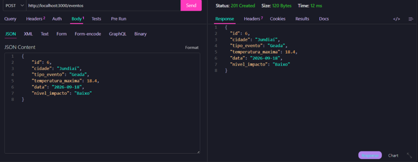
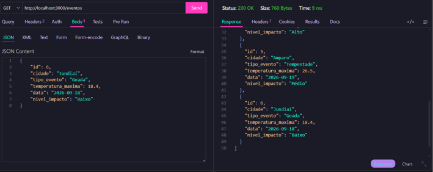
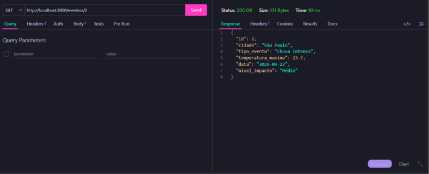
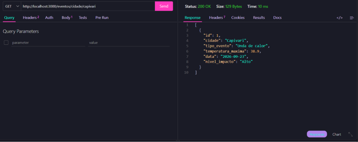
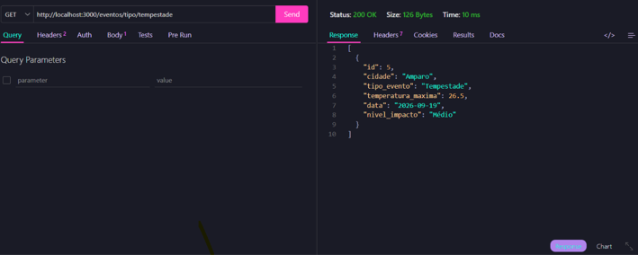
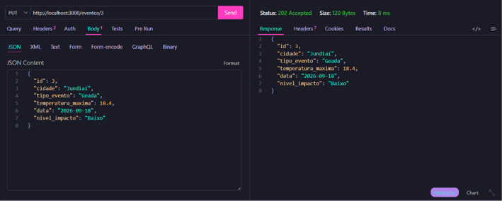
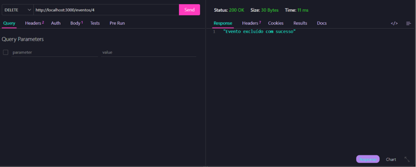
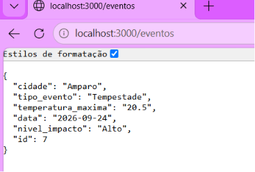

# Registro de Eventos Climáticos Extremos Back-end

### Exemplo simples de back-end com mockup de dados JSON e funcionalidades CRUD padrão

## Tecnologias 
- Node.js
- JavaScript 
- VsCode
- VsCode Thunder Client 

## Passos para Testar
- 1 Clone este repositório
- 2 Abra com VsCode e em um terminal digite

```
npm install
npm run dev
```
- 3 Teste as rotas com a extensão ```Thunder Client``` do VsCode
- 4 Abra o arquivo client/index.html com a extensão ```Live Server```

## Print dos testes e exemplo de requisições

- CREATE <br>


- READ ALL <br>


- BUSCAR POR ID <br>


- BUSCAR POR CIDADE <br>


- BUSCAR POR EVENTO <br>


- UPDATE <br>


- DELETE <br>


## Cliente 


## Resposta : 
